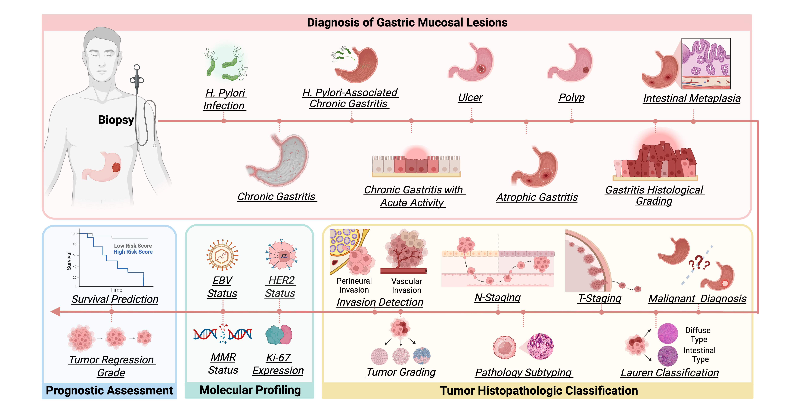

# GRACE: A Gastric-Specific Pathology Foundation Model

<p align="center">
  
</p>

**GRACE** is a **gastric-specialized** pathology foundation model for morphology-driven precision pathology. GRACE is designed around the **gastric pathology workflow**, supporting decision-making from mucosal lesion diagnosis and tumor histological classification to molecular biomarker prescreening and survival-risk stratification. By extracting clinically actionable signals from routine H&E slides, GRACE provides a practical foundation for targeted patient stratification, workflow-aware diagnostic support, and deployable gastric pathology AI.


# 🔬 Demo

The platform integrates the **GRACE** checkpoint and provides a web-based interface for reviewing pathology cases, visualizing model-generated diagnostic support, and collecting reader-study responses in a controlled setting.

[](https://smartpathology.top/login)

Model weights for reviewer evaluation can be accessed via [OneDrive](https://hkustconnect-my.sharepoint.com/:u:/r/personal/lliangaq_connect_ust_hk/Documents/GRACE_ckpt/GRACE.pth?csf=1&web=1&e=DSiPV7). To request a demo trial account or ask about access, please contact [Ling LIANG](mailto:ling.liang@connect.ust.hk).


# 🌲 Repository Layout

- `pretrain/`: DINO-style LoRA continual pretraining code based on Virchow2 checkpoint using gastric pathology patches stored in HDF5 (`.h5`) files.
- `downstream_tasks/classification/`: ABMIL-based case-level classification using pre-extracted `.pt` feature tensors.
- `downstream_tasks/survival/`: ABMIL-based survival prediction using pre-extracted `.pt` feature tensors.

# 📊 Data Preparation

For WSI preprocessing, patch coordinate extraction, HDF5 (`.h5`) patch dataset generation for pretraining, and feature extraction for downstream tasks, refer to [PrePATH](https://github.com/birkhoffkiki/PrePATH).

Downstream tasks in this repository do not extract features from WSIs directly. They expect slide-level features saved as `.pt` tensors. If the feature name is `GRACE`, the expected directory layout is:

```text
/path/to/features/GRACE/<slide_id>.pt
```

The `<slide_id>` should match the slide identifier in the downstream label table. In practice, use slide IDs or slide filenames that resolve to the corresponding `.pt` feature basename.


# 🚀 Pretraining

Use `pretrain/` to reproduce **DINO-style LoRA continual pretraining**. The code reads `.h5` files recursively from `--data_path`. Each file should contain a `patches` field storing JPEG-compressed patch image bytes.

## Environment

```bash
conda env create -f pretrain/myenv.yml
conda activate dino_lora
```

The released environment records PyTorch `2.5.1+cu121`, torchvision `0.20.1+cu121`, timm `1.0.24`, peft `0.16.0`, loralib, h5py `3.15.1`, numpy `2.2.6`, and Pillow `12.1.0`.

## Running Pretraining

```bash
cd pretrain

torchrun --nproc_per_node=8 main_dino.py \
  --arch virchow2 \
  --data_path /path/to/data \
  --output_dir /path/to/output \
  --saveckp_freq 1 \
  --batch_size_per_gpu 48 \
  --patch_size 14 \
  --local_crops_size 98
```

## Essential Pretraining Arguments

| Argument | Default | Description |
|---|---:|---|
| `--arch` | `virchow2` | Backbone architecture. |
| `--data_path` | `/path/to/data` | Root directory containing `.h5` pretraining files. |
| `--output_dir` | `.` | Directory for checkpoints and `log.txt`. |
| `--batch_size_per_gpu` | `128` | Per-GPU batch size. |
| `--epochs` | `100` | Number of pretraining epochs. |
| `--patch_size` | `16` | ViT patch-size argument. |
| `--local_crops_size` | `96` | Size of local crops used in DINO multi-crop augmentation. |
| `--saveckp_freq` | `20` | Saves a numbered checkpoint every N epochs. |

The script applies LoRA adapters to the student and teacher backbones with rank `8`, alpha `16`, target modules `attn.qkv` and `attn.proj`, and dropout `0.1`.

## Pretraining Outputs

All pretraining outputs are saved under `--output_dir`.

Expected files:

- `checkpoint.pth`: latest checkpoint, also used for automatic resume.
- `checkpointXXXX.pth`: periodic epoch checkpoints saved according to `--saveckp_freq`.
- `checkpoint_<iteration>.pth`: intermediate iteration checkpoint saved during long training runs.
- `log.txt`: training metrics written as one JSON record per epoch.


# 🧬 Downstream Evaluation

The downstream code uses **ABMIL** on pre-extracted GRACE features. 

- `downstream_tasks/classification/`: case-level classification.
- `downstream_tasks/survival/`: survival prediction for OS or DFS.

## 1. Classification

See `downstream_tasks/classification/README.md` for task-specific details.

### Environment

```bash
cd downstream_tasks/classification
conda env create -f dstr.yml
conda activate dstr
```

### Label Table

The classification pipeline reads a CSV or Excel label table through `--excel_file`.

Required columns:

- `slide`: slide identifier matching the `.pt` feature filename.
- `label`: class label. A different label column can be selected with `--label_column`.
- `split`: split assignment, typically `train`, `val`, or `test`.

Optional columns such as `case`, `dataset`, `study`, `cohort`, or `source` can be included for grouping or filtering.

### Running Classification

```bash
python main.py \
  --model ABMIL \
  --root /path/to/features \
  --feature GRACE \
  --study demo \
  --excel_file dataset_excel/demo.xlsx \
  --num_epoch 50 \
  --batch_size 1
```

### Essential Classification Arguments

| Argument | Default | Description |
|---|---:|---|
| `--model` | `ABMIL` | Classification model. The current code implements `ABMIL`. |
| `--root` | none | Root directory containing feature folders. |
| `--feature` | none | Feature name. |
| `--study` | none | Study name used in the result directory. |
| `--excel_file` | `None` | CSV or Excel label/split file. |
| `--label_column` | `label` | Column used as the class label. |
| `--batch_size` | `1` | Batch size. |
| `--num_epoch` | `30` | Maximum number of training epochs. |
| `--lr` | `2e-4` | Learning rate. |
| `--optimizer` | `Adam` | Optimizer. Choices are `SGD`, `Adam`, `AdamW`, `RAdam`, `PlainRAdam`, and `Lookahead`. |

## 2. Survival Prediction

See `downstream_tasks/survival/README.md` for task-specific details.

### Environment

```bash
cd downstream_tasks/survival
python -m pip install -r requirements.txt
```

### Survival Label Table

The survival pipeline reads a CSV or Excel label table through `--excel_file`.

Required columns after normalization:

- `case`: case or patient identifier. `case_id` is also accepted.
- `slide`: slide identifier, filename, or multiple slide names separated by `;` or `,`. `filename` is also accepted.
- `event_time`: survival time. `time (month)` is also accepted.
- `event_status`: event indicator, where `1` means event and `0` means censored. `label` is also accepted.
- `dataset`: dataset/source name. If absent, the code infers one from the feature root or label-table path.
- `Fold 0` to `Fold 4`: fold assignment columns. If these are absent, a valid `split` column can be converted into fold columns.

During loading, rows from the same case are aggregated into one case-level sample. 

### Running Survival Prediction

```bash
python main.py \
  --study demo_survival \
  --feature GRACE \
  --root /path/to/features \
  --excel_file dataset_excel/demo_survival_labels.csv \
  --output_dir result
```

### Essential Survival Arguments

| Argument | Default | Description |
|---|---:|---|
| `--study` | required | Study name used in the output directory. |
| `--feature` | required | Feature folder name. |
| `--root` | required | Root directory containing feature folders. |
| `--excel_file` | required | CSV or Excel survival label/split file. |
| `--output_dir` | `result` | Base output directory. Results are saved under `<output_dir>/<study>/<model>/<feature>/<timestamp>/`. |
| `--modal` | `os` | Survival endpoint. Choices are `os` and `dfs`. |
| `--batch_size` | `1` | Batch size. |
| `--num_epoch` | `50` | Maximum number of training epochs per fold. |
| `--lr` | `1e-4` | Learning rate. |
| `--patience` | `10` | Early-stopping patience based on holdout C-index. |
| `--n_bins` | `4` | Number of discrete survival time bins. |
| `--loss` | `nll_surv` | Survival loss. Choices are `nll_surv`, `ce_surv`, and `nll_surv_l1`. |

The survival run writes `metrics.csv`, `predictions.csv`, and one best checkpoint per fold under the timestamped output directory.

# Acknowledgements

We thank the authors and developers of the following resources:

- **PrePATH** ([GitHub](https://github.com/birkhoffkiki/PrePATH)) for scalable WSI preprocessing and patch extraction.
- **Aslide** ([GitHub](https://github.com/MrPeterJin/ASlide)) for multi-format WSI reading.
- **mSTAR** ([GitHub](https://github.com/Innse/mSTAR/tree/main)) for whole-slide multimodal pathology foundation modeling.
- **GPFM** ([GitHub](https://github.com/birkhoffkiki/GPFM/?tab=readme-ov-file)) for real-world pathology foundation model benchmarking.
- **Virchow2** ([Hugging Face](https://huggingface.co/paige-ai/Virchow2)) for the vision transformer backbone.
- **CLAM** ([GitHub](https://github.com/mahmoodlab/CLAM)) for weakly supervised multiple instance learning.

# License and Terms of Use

ⓒ SmartXLab. This model and associated code are released under the [CC-BY-NC-ND 4.0](https://creativecommons.org/licenses/by-nc-nd/4.0/deed.en) license and may only be used for non-commercial academic research with proper attribution. Commercial use, sale, or monetization of the GRACE model or derivatives of the GRACE model requires prior approval.
